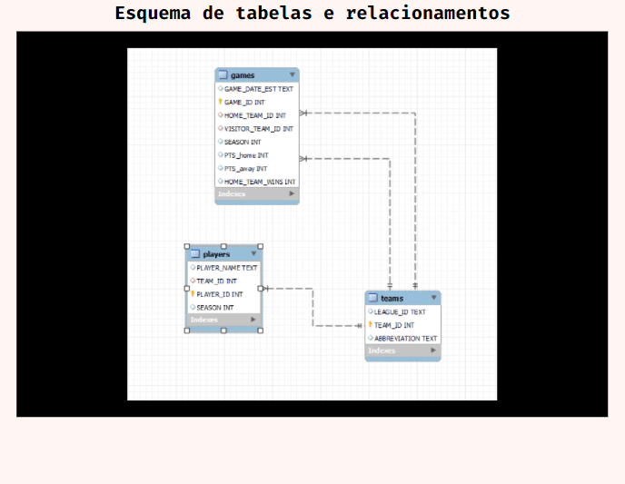

 

    

  <h3 align="center">Trabalho Módulo 3 - Visualização de dados</h3> 

  

     Projeto desenvolvido como projeto final do Módulo 3 do curso de Desenvolvedor Web FullStack da <a class="credits" href="https://www.resilia.com.br" target="_blank">Resilia Educação</a>

  
  
  

     Visualização de dados
      

  <a href="#sobre"> Sobre </a> |
  <a href="#conhecimentos-praticados"> Conhecimentos praticados </a> |
  <a href="#perguntas"> Perguntas </a>    
        
     
    <h1 align="center">
    
 </h1>
  

# Sobre
O objetivo do projeto foi criar gráficos que respondessem as perguntas elaboradas de acordo com a análise feita do banco de dados.

# Conhecimentos Praticados
✔ MySQL  
✔ MySQL Workbench  
✔ PowerBI  

# Perguntas:
<b> Qual time fez mais pontos jogando fora de casa de 2003 até 2013?</b>  

  SELECT SUM(PTS_away), NICKNAME, TEAM_ID, ABBREVIATION   
  FROM games  
  INNER JOIN TEAMS  
  ON games.VISITOR_TEAM_ID = teams.TEAM_ID  
  WHERE SEASON IN (2003, 2013)  
  GROUP BY TEAM_ID ORDER BY SUM(PTS_away) DESC LIMIT 5;

   
 
 <b> Qual time teve mais jogadores nas temporadas de 2009 a 2019?</b>  

  SELECT TEAM_ID, NICKNAME, COUNT(TEAM_ID)  
   FROM players  
   INNER JOIN teams  
   USING (team_id)  
   GROUP BY team_id  
   ORDER BY count(TEAM_ID)  
   DESC LIMIT 5
Teste

   

  <b> Quais foram os 5 jogadores que jogaram em mais times?</b>  

  SELECT PLAYER_NAME, COUNT(TEAM_ID)  
  FROM players  
  GROUP BY player_name  
  ORDER BY count(team_id)  
  DESC LIMIT 5;

   

  <b> Qual time mais venceu jogando em casa?</b>  

 SELECT HOME_TEAM_ID,
 ABBREVIATION as ABREV,
 NICKNAME as APELIDO, COUNT(HOME_TEAM_ID) as TOTAL_VITORIAS,
 HOME_TEAM_WINS as VIT_CASA  
FROM games  
INNER JOIN teams  
ON games.HOME_TEAM_ID = teams.TEAM_ID  
GROUP BY HOME_TEAM_ID  
HAVING VIT_CASA = 1  
ORDER BY TOTAL_VITORIAS desc;

   

---
**Desenvolvido  por [Bruno Andreotti](www.linkedin.com/in/bruno-andreotti/), [Cibele Martins](https://www.linkedin.com/in/cibelemartinssss/), [Gicelle Sena ](https://www.linkedin.com/in/gicellesena/), [Jamerson David](https://www.linkedin.com/in/jamerson-david-13b641171/) e [Maysa Pereira](https://www.linkedin.com/in/maysa-pereira/), .** 